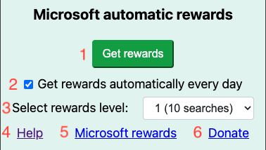

# MicrosoftRewardsBot

Script that gives you maximum ammout of microsoft rewards points every day automatically or by a click of a button.   Website: 

<h4> <a href="https://chromewebstore.google.com/detail/microsoft-automatic-rewar/ocmmbfdhomnkljmjkmafegefcgcfkefo?pli=1"> DOWNLOAD  </a></h4>

## Features
 

 
<ol>
                <li>Open 10 random tabs in Bing and close them once they are loaded to get maximum search points.</li>
                <li>Automatically open 10 tabs every day when you open the browser (turned on by default on install).</li>
                <li>Select Microsoft Rewards level (If you have the automatic checkmark, you should reach lvl 2 after 1 month)</li>
                <li>Get help</li>
                <li>Visit the Microsoft Rewards site and log in.</li>
                <li><a href="https://www.paypal.com/donate/?hosted_button_id=4WXEWMN3QGLGY" target="_blank">Donate with PayPal or any credit card </a></li>
</ol>

## HOW TO USE
Simplest way: download extension from: https://chromewebstore.google.com/detail/microsoft-automatic-rewar/ocmmbfdhomnkljmjkmafegefcgcfkefo?pli=1

 
<strong>OR </strong>

<ol>
    <li>In command prompt: git fork https://github.com/spin311/MicrosoftRewardsBot</li>
    <li> Google-> 3 dots in the right corner-> manage extensions </li>
    <li> In the top right corner toggle on Developer mode</li>
    <li> In the top left corner click Load unpacked</li>
    <li> Select the folder where you have forked the repository</li>
    <li> Click the puzzle icon in the top right corner (extensions) and pin the new extension</li>
    <li> Click on the extension icon to use it</li>

</ol>

If you have any suggestions or questions, you can contact me at <u><b> <mark> spin311pro@gmail.com </mark></b></u>.

